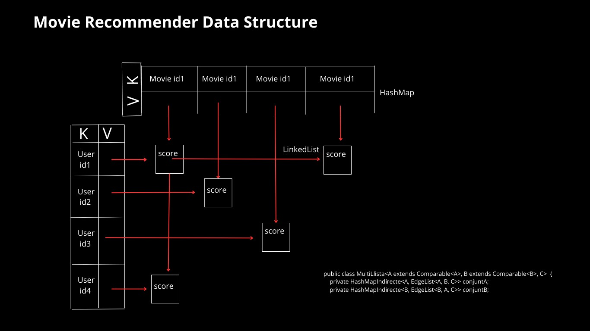
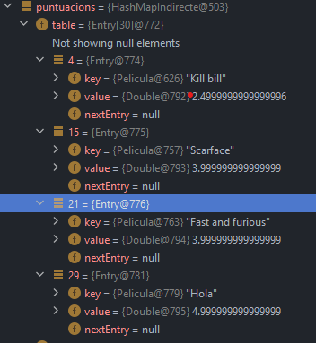
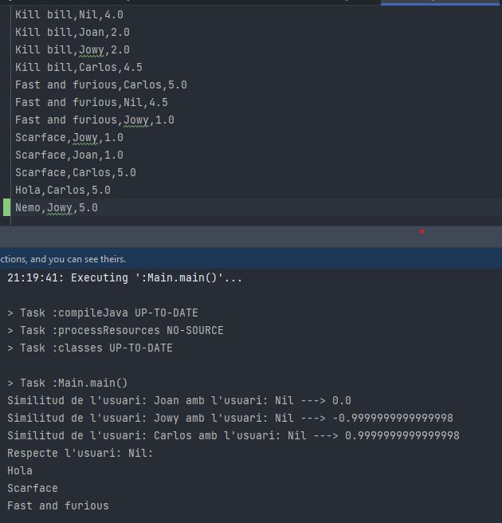
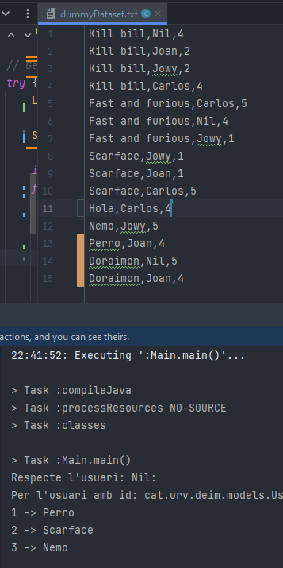
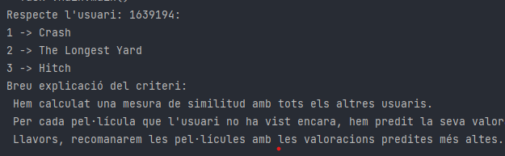
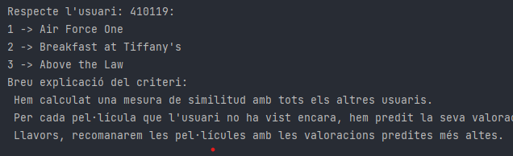

# Introducció
En aquest treball final d'estructura de dades, l'objectiu final ha estat desenvolupar un sistema de recomanació de pel·liícules, com el challenge que va proposar Netflix.
Per fer-ho s'han construït diverses classes d'estructres de dades des de zero, per entendre el seu funcionament i mica en mica montar el recomanador.

# Classes principals creades

1. **LlistaDoblementEncadenada<E>**
   La classe `LlistaDoblementEncadenada<E>` és una implementació d'una llista doblement encadenada genèrica en Java. Permet l'emmagatzematge de qualsevol tipus d'objecte (tipus genèric E) en una llista, on cada node està connectat tant al seu anterior com al seu següent node.

2. **HashMapIndirecte<K, V>**
   La classe `HashMapIndirecte<K, V>` és una implementació d'una taula de hash indirecta genèrica en Java, que emmagatzema parells de claus i valors. Aquesta estructura de dades permet emmagatzemar i recuperar objectes de manera eficient a partir de claus úniques.

3. **MultiLlista<A, B, C>**
   La classe `MultiLlista<A, B, C>` en Java és una implementació d'una estructura de dades que combina dues llistes (conjunts A i B) en una sola estructura. Cadascun dels elements en el conjunt A està associat a un o més elements en el conjunt B, i viceversa. A més, cada parella d'elements (un de cada conjunt) està associada a un valor de tipus C. Aquesta classe pot ser útil per representar relacions n a m, com per exemple, entre pel·lícules i usuaris en un sistema de recomanació.

# Estructura del projecte 

# Sistema de recomanació

A l'hora de dissenyar el sistema de recomanació, he optat per mantenir l'estructura de dades multillista que havia creat i la taula de hash indirecte, per gestionar les dades d'una manera més eficient.

### Metodologia

Aquí està una descripció general del disseny del sistema:

0. **Càrrega de dades**: Carreguem les dades del conjunt de dades a la nostra estructura de dades `MultiLlista`, que emmagatzema les dades en una forma que facilita el càlcul de la correlació de Pearson.

1. **Càlcul de similituds:** Per a cada usuari, calcularem una mesura de similitud amb tots els altres usuaris. Aquesta similitud es basa, en el coeficient de correlació de Pearson, que té en compte tant el nombre de pel·lícules vistes per ambdós usuaris com les seves valoracions. Posteriorment s'explicarà més informació relacionada amb el coeficient i la decisió algorítmica.

2. **Recomanació de pel·lícules:** Amb les mesures de similitud calculades, podem recomanar pel·lícules a un usuari determinat. Per a això, per cada pel·lícula que l'usuari no ha vist encara, predirem la seva valoració com a mitjana ponderada de les valoracions d'aquells usuaris similars que han vist la pel·lícula, on els pesos són les similituds dels usuaris. Llavors, recomanarem les pel·lícules amb les valoracions predites més altes.

3. **Generació de raonament:** Per cada pel·lícula recomanada, generarem un raonament que expliqui per què es recomana. Aquest raonament podria ser, per exemple, una llista dels usuaris similars que han vist la pel·lícula i les seves valoracions.

Podem apreciar com ens retorna les pelis ordenades en funció de la puntuació. 

## Decisió de disseny algorítmic

Aquest disseny està basat en el mètode de filtratge col·laboratiu, que és un dels mètodes més utilitzats per a recomanacions. Un dels seus avantatges és que no necessita informació addicional sobre les pel·lícules o els usuaris, a part de les interaccions anteriors. A més, es pot adaptar a les preferències canviants dels usuaris a mesura que es recullen més dades.

Tot i haver estat estudiant altres algoritmes de grafs darrerament com BFS, DFS, A*... El que passava és que per la naturalesa d'aquest problema no m'han semblat les més encertades. En el cas d'un sistema de recomanació de pel·lícules com el que estem discutint, estem interessats en comparar les valoracions de pel·lícules dels usuaris per determinar quins usuaris són similars entre ells. Aquest tipus de problema no sol implicar la cerca d'un camí més curt entre dos punts (Dijkstra) ni la cerca en profunditat o en amplada d'un graf (DFS o BFS). En canvi, si estiguéssim treballant en un problema que impliqués la cerca d'un camí en un graf, com per exemple trobar la ruta més curta entre dues ciutats en un mapa, aleshores sí que faríem servir algoritmes com Dijkstra, DFS o BFS.
Al contrari, l'algoritme de Filtració Col·laborativa consisteix a trobar usuaris similars (k-neighbour) basant-se en les seves valoracions de pel·lícules. Si dos usuaris han valorat de manera similar un conjunt de pel·lícules, es consideren similars. Després, per a recomanar una pel·lícula a un usuari, es busca entre les pel·lícules que han agradat als seus usuaris similars.

## Estudi de dades utilitzant el Coeficient de Pearson

En aquest estudi de dades, utilitzem el coeficient de Pearson per determinar la correlació entre les valoracions de diferents usuaris per a diverses pel·lícules. Aquesta correlació ens pot ajudar a entendre la similitud entre les preferències dels usuaris.

### Selecció de la relació Usuari-Pel·lícula

Aquesta funció és una implementació del coeficient de correlació de Pearson, que es fa servir per mesurar el grau de relació entre dues variables. En aquest cas, s'està utilitzant per mesurar la similitud entre dos usuaris basant-se en les seves valoracions de pel·lícules.

A continuació es detalla cada línia de codi en aquest mètode:

1. **Inicialitza la suma de les valoracions de les pel·lícules de l'usuari u1 (`sumX`)**, la suma de les valoracions de l'usuari u2 (`sumY`), la suma del producte de les valoracions de les pel·lícules valorades per ambdós usuaris (`sumXY`), i la suma dels quadrats de les valoracions de les pel·lícules de cada usuari (`sumXSq`, `sumYSq`). També inicialitza el nombre de pel·lícules valorades per ambdós usuaris (`n`).

2. **Obté les llistes de pel·lícules que han estat valorades per cada un dels dos usuaris.**

3. **Per a cada pel·lícula valorada per l'usuari u1, comprova si l'usuari u2 també l'ha valorada.** Si és així, actualitza totes les sumes i augmenta el nombre de pel·lícules valorades per ambdós usuaris (`n`).

4. **Si cap dels usuaris ha valorat cap pel·lícula en comú, la similitud és 0.**

5. **Calcula el denominador de la fórmula de Pearson.** Si és zero, la similitud també és zero.

6. **Calcula i retorna el coeficient de correlació de Pearson,** que és el numerador dividit pel denominador.

La correlació de Pearson resultant és un nombre entre -1 i 1. Un valor de 1 indica que els dos usuaris tenen gustos molt similars (sempre valoren les pel·lícules de la mateixa manera), un valor de -1 indica que tenen gustos molt oposats (sempre valoren les pel·lícules de manera oposada), i un valor de 0 indica que no hi ha cap relació evident entre les maneres en què els dos usuaris valoren les pel·lícules.

## Conjunt de dades

El nostre conjunt de dades consisteix en valoracions de pel·lícules per part d'usuaris individuals. Les dades es presenten en el següent format:

`Pel·lícula,Usuari,Puntuació`

Per exemple:

## Resultats esperats

Els coeficients de Pearson entre usuaris ens permeten determinar quins usuaris tenen gustos similars basant-nos en les seves valoracions de pel·lícules. Aquesta informació pot ser útil per a recomanacions de pel·lícules: si dos usuaris tenen una alta correlació de Pearson, és probable que a un usuari li agradi una pel·lícula que l'altre usuari ha valorat altament.

En aquest exemple anterior, clarament es mostra com Nil i Carlos tenen gustos semblants, Nil i Joan cap relació i Nil i Jowy gustos inversament proporcionals.
Amb aquest dataset tant petit, l'algoritme tendirà a tenir **molta variança**, i estarà **"Overfitted"**
En aquest cas, com més gran és el dataset millor. 

## Testing amb dataset de Netflix

S'ha processat exitosament les dades del primer dataset proposat:

## Limitacions i millores futures
En primer lloc, la implementació no és òptima a nivell de temps d'execucuió, ja que hi ha moltes iteracions per poder fer tots els càlculs necessaris. S'ha anteposat la qualitat de la resposta (implementació adequada pel problema) abans que el temps de resposta.

D'altra banda, aquesta anàlisi és simplista i es podria millorar de diverses maneres. Per exemple, podríem tenir en compte més factors, com ara les valoracions de pel·lícules dels amics d'un usuari, les valoracions mitjanes de cada pel·lícula, o fins i tot altres dades com l'edat o el sexe dels usuaris.

Finalment, cal tenir en compte que la correlació no implica causalitat. Tot i que dos usuaris poden tenir una alta correlació de Pearson, això no significa necessàriament que tinguin gustos similars, sinó simplement que les seves valoracions de pel·lícules es mouen juntes d'una manera particular.
